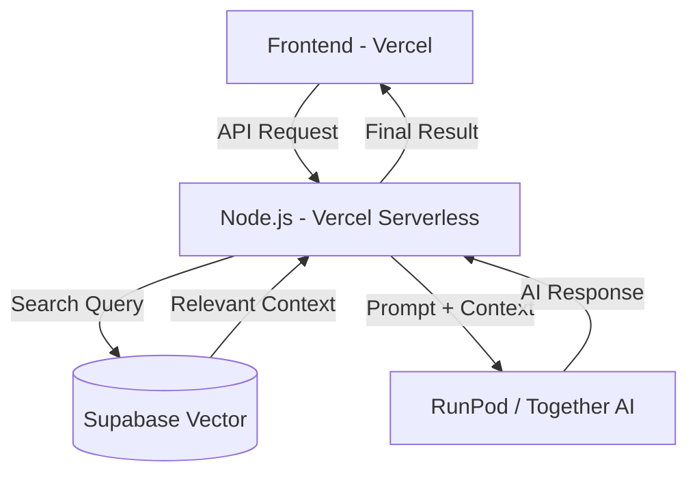

# 🚀 Professional AI Architecture for GuildBoard

This guide outlines how to build a production-grade AI that learns from your data, runs in the cloud, and integrates with your Vercel deployment.

---

## 1. The "No Data" Problem: Synthetic Cold Start
Since you don't have thousands of quests yet, you cannot fine-tune on "real" data. Instead, we use **Synthetic Data Generation**.

1.  **The Seed**: Define your GuildBoard rules (XP, Roles, Tone).
2.  **Generation**: Use a script to ask a high-end model (like GPT-4o or Claude) to:
    > "Generate 500 examples of quests, council reviews, and level-up messages in the style of a gritty RPG Dungeon Master for a dev guild."
3.  **Outcome**: You now have a `synthetic_dataset.jsonl` to perform your initial fine-tune.

---

## 2. Real-Time Learning: RAG (Retrieval-Augmented Generation)
**CRITICAL**: Fine-tuning is for *Persona/Style*. **RAG** is for *Knowledge/Data*.
To make the AI "learn" as your database grows, you don't re-train the model every day. Instead:

1.  **Vector Database**: Use **Supabase Vector** or **Pinecone**.
2.  **The Pipeline**:
    - When a user creates a Quest, your backend sends the text to an `embedding model`.
    - The "vector" (a list of numbers representing the meaning) is stored in the Vector DB.
3.  **The Retrieval**:
    - When someone asks "Who is our best bug hunter?", the AI searches the Vector DB for "bug hunter" + "completion status".
    - It finds the real data and uses it to answer.

---

## 3. Cloud Hosting: Moving away from Localhost
Since your app is on Vercel, it cannot talk to your personal computer. You need a Cloud AI Provider.

### Option A: Together AI / Groq (Recommended for Speed)
These providers allow you to upload a custom fine-tuned model or use their high-speed open-source models (Llama 3 70B).
- **Pros**: Sub-second response times, very cheap.
- **Connection**: Simple API call from your Vercel functions.

### Option B: RunPod (Custom GPU Hosting)
If you want 100% control, you rent a "Serverless GPU" on RunPod.
- **How it works**: The GPU only turns on when a user asks a question, then turns off to save you money.
- **Connect**: Your backend calls your RunPod Endpoint URL.

---

## 4. The Production Architecture (Vercel Friendly)



---

## 5. Implementation Steps

### Step 1: Set up a Vector Table in Postgres
Run this in your Supabase/Postgres SQL editor:
```sql
-- Enable the pgvector extension
create extension if not exists vector;

-- Create a table for quest embeddings
create table quest_embeddings (
  id uuid primary key default uuid_generate_v4(),
  task_id integer references tasks(id),
  content text,
  embedding vector(1536) -- size for OpenAI/Voyage embeddings
);
```

### Step 2: The "Sync" Trigger
Whenever a quest is created or verified, you must update the Vector DB:
```javascript
// server/services/aiService.js
const syncQuestToAI = async (task) => {
  const content = `Quest: ${task.title}. Assigned to: ${task.assignee_name}. Status: ${task.status}`;
  const embedding = await getEmbedding(content); // Use OpenAI or local transformer
  await db.query('INSERT INTO quest_embeddings (task_id, content, embedding) VALUES ($1, $2, $3)', [task.id, content, embedding]);
};
```

### Step 3: Cloud API Connection
In your `.env` file on Vercel:
```env
AI_PROVIDER_KEY=your_together_ai_key
AI_API_URL=https://api.together.xyz/v1/chat/completions
MODEL_NAME=meta-llama/Llama-3-70b-chat-hf
```

---

## 7. AI Use Cases: What does the "Dungeon Master" actually do?

To make the AI useful, it shouldn't just be a chatbot. Here are the core features it will drive:

### A. Automated Quest Forging
Leaders are busy. Instead of writing long descriptions, they type a title like *"Fix the API lag"* and the AI:
- **Immersive Writing**: Turns it into: *"⚔️ The Great Latency Beast has slowed our scrolls! Exorcise the inefficient SQL spirits to restore speed to the realm."*
- **Checklist Generation**: Automatically adds sub-tasks like *"Profile query performance"* and *"Add index to users table"*.

### B. Smart XP Balancing
The AI analyzes the difficulty, deadline, and required skills to suggest a fair `base_xp`.
- *"This quest involves high-risk database migration. Suggesting +250 XP instead of the standard +100."*

### C. The Council’s Advisor
When a member submits a quest for review:
- **Sentiment Analysis**: The AI reads the submission notes and compares them to the original quest.
- **Score Suggestion**: It suggests a Quality Multiplier (0.8x, 1.0x, 1.2x) to the leader based on how thorough the work seems.

### D. Monthly Guild Chronicles
Instead of boring bar charts, the AI reads all verified quests for the month and writes an **Epic Saga**:
- *"In the month of April, Sir Tanveer vanquished the K-Fold Dragon, earning 500 XP and leading the Beyond Limiter guild to new heights of prosperity..."*

### E. Smart Search & Support
Members can ask: *"What should I work on today?"* 
The AI looks at their skills, current level, and the available Quest Board to recommend the perfect task.

---

## 8. 📦 Model Storage & Deployment Workflow
Once you have finished your local fine-tuning, follow this workflow to make it accessible to your Vercel app:

### Step 1: Upload to Hugging Face
[Hugging Face](https://huggingface.co/) is the "GitHub of AI."
- Create a **Private Repository**.
- Upload your `.safetensors` or `.gguf` files.
- Your model is now securely stored in the cloud.

### Step 2: Choose your Cloud "Runner"
Now you need a server to actually "run" the code in your model files:
- **Together AI / Replicate**: You can point them to your Hugging Face repo, and they will create a private API endpoint for you.
- **Hugging Face Inference Endpoints**: HF will manage the servers for you. You pay per hour only when the server is active.
- **RunPod Serverless**: Best for saving money. It spins up a GPU in seconds when a user makes a request and shuts down immediately after.

### Step 3: Connect to GuildBoard
Update your Vercel `.env` to point to the new Cloud Endpoint:
```env
AI_API_URL=https://api.runpod.ai/v1/your-endpoint-id/chat/completions
AI_API_KEY=your_secret_key
```

---

## 9. Summary: The Hybrid Approach
1.  **Fine-Tune (Monthly)**: For the "Dungeon Master" voice and understanding your specific GuildBoard terminology.
2.  **RAG (Instant)**: For knowing what's happening in your database right now.
3.  **Cloud API (Permanent)**: To ensure 99.9% uptime for your users on Vercel.

---

**Strategy analyzed and designed by MayazAD.**
